<!--
Steins;Gate themed profile - RXCCCCCC
-->

<p align="center">
  
</p>

<p align="center">
  
</p>

<p align="center">
  
</p>

<!--WORLDLINE:START-->
```text
 [LAB MEM 004] WORLDLINE OBSERVATION LOG
 ─────────────────────────────────────────────
  Divergence     : 1.048596 %  (Steins;Gate)
  Lab Time (CST) : 2026-09-01 13:18
  Status         : Reading Steiner — INACTIVE
  Operation      : SKULD — profile auto-sync OK
 ─────────────────────────────────────────────
```
<!--WORLDLINE:END-->

## 🧪 About Me

- 🎓 Undergraduate at **Dalian University of Technology**, School of Software; exchange year at **South China University of Technology** (2025-2026); short-term exchange program in **Japan**
- 🔭 Research interests: **Agent / MLLM / Multimodal** — building practical interactive AI systems
- 📫 Reach me: [xiongchao.rao@gmail.com](mailto:xiongchao.rao@gmail.com)
- 📝 Blog: [blog.rxcccccc.icu](https://blog.rxcccccc.icu/)

## 🏆 Honors

| Award | Level |
| --- | --- |
| National Scholarship (2025) | National |
| The 17th Lanqiao Cup — C/C++ Group A, Third Prize (National Final) | National |
| Asia-Pacific Mathematical Contest in Modeling (APMCM 2025) — Third Prize | National |
| China Collegiate Computing Contest — AI Application Track, Second Prize | Provincial |

## 🛠️ Tech Stack

<p align="center">
  
</p>

## 📌 Featured Projects

<table align="center">
  <tr>
    <td align="center">
      <a href="https://github.com/RXCCCCCC/lanxin-travelmate-aigc-2026"><b>lanxin-travelmate-aigc-2026</b></a><br/>
      <sub>AIGC travel-mate agent for the Lanxin Cup 2026</sub><br/><br/>
      
      <a href="https://github.com/RXCCCCCC/lanxin-travelmate-aigc-2026"></a>
    </td>
    <td align="center">
      <a href="https://github.com/RXCCCCCC/The_Temptation_of_Dahei_Mountain"><b>The_Temptation_of_Dahei_Mountain</b></a><br/>
      <sub>C++ game project</sub><br/><br/>
      
      <a href="https://github.com/RXCCCCCC/The_Temptation_of_Dahei_Mountain"></a>
    </td>
  </tr>
  <tr>
    <td align="center">
      <a href="https://github.com/RXCCCCCC/dlut-aigc-project"><b>dlut-aigc-project</b></a><br/>
      <sub>AIGC web application built with Vue</sub><br/><br/>
      
      <a href="https://github.com/RXCCCCCC/dlut-aigc-project"></a>
    </td>
    <td align="center">
      <a href="https://github.com/RXCCCCCC/cjw_red_map"><b>cjw_red_map</b></a><br/>
      <sub>Red-tourism map web app built with Vue</sub><br/><br/>
      
      <a href="https://github.com/RXCCCCCC/cjw_red_map"></a>
    </td>
  </tr>
</table>

## 📊 Stats

<p align="center">
  
</p>

<p align="center">
  
</p>

## 🐍 Contribution Snake

<p align="center">
  <picture>
    <source media="(prefers-color-scheme: dark)" srcset="https://raw.githubusercontent.com/RXCCCCCC/RXCCCCCC/output/github-snake-dark.svg" />
    
  </picture>
</p>

<p align="center">
  <a href="mailto:xiongchao.rao@gmail.com"></a>
  
</p>

<p align="center">
  
</p>
